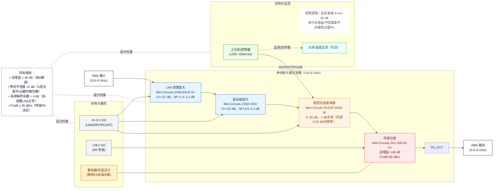

```mermaid
flowchart LR
  %% =======================
  %% Wideband RF Amplifier (0.6–6 GHz) with Programmable Attenuator
  %% Chain: LNA -> Driver -> 0–30 dB Atten (1 dB step) -> PA (P1dB≈35 dBm)
  %% =======================

  %% I/O
  IN["SMA 输入\n(0.6–6 GHz)"]:::io --> LNA
  PA_OUT --> OUT["SMA 输出\n(0.6–6 GHz)"]:::io

  %% Subgraph: RF Chain
  subgraph RF["单体放大器主链路（0.6–6 GHz）"]
    direction LR

    LNA["LNA 前置放大\nMini-Circuits ZX60-83LN-S+\nG≈+21 dB，NF≈1.4–2.2 dB"]:::block
    DRV["驱动级放大\nMini-Circuits ZX60-V63+\nG≈+15 dB，NF≈3.6–4.3 dB"]:::block
    ATT["程控步进衰减器\nMini-Circuits RCDAT-6000-30\n0–30 dB，1 dB步进（内部0.25 dB分辨率）"]:::atten
    PA["终级功放\nMini-Circuits ZHL-5W-63-S+\n总增益≈+46 dB\nP1dB≈35 dBm"]:::power

    LNA --> DRV --> ATT --> PA
    PA --> PA_OUT
  end

  %% Control / Power
  subgraph CTRL["控制与监控"]
    direction TB
    UI["上位机/控制器\n(USB / Ethernet)"]:::ctrl
    NOTE["控制逻辑：设定衰减 A=10–30 dB\n用于总增益/平坦度配平\n并避免过驱PA"]:::note
    UI -- SCPI/HTTP/USB --> ATT
    UI -. 监测点/传感 .-> MON["功率/温度监测（可选）"]:::mon
  end

  %% Power Rails
  subgraph PWR["供电与散热"]
    direction TB
    V5["+5~6 V DC\n(LNA/DRV/RCDAT)"]:::pwr
    V28["+28 V DC\n(PA 专用)"]:::pwr
    HS["散热器/风道设计\n(确保PA结温余量)"]:::therm
  end

  V5 --> LNA
  V5 --> DRV
  V5 --> ATT
  V28 --> PA
  HS --- PA

  %% Targets / Specs
  SPEC["目标指标：\n• 总增益 > 45 dB（由A精调）\n• 带内平坦度 ±2 dB（A逐点配平/必要时微均衡）\n• 系统噪声系数 < 4 dB（由前置LNA主导）\n• P1dB ≥ 35 dBm（终级PA决定）"]:::spec

  SPEC -. 设计约束 .- RF
  SPEC -. 设计约束 .- CTRL
  SPEC -. 设计约束 .- PWR

  %% Styles
  classDef block fill:#E8F4FF,stroke:#1E66F5,stroke-width:1.2,color:#0B3B75;
  classDef atten fill:#FFF4E5,stroke:#F59E0B,stroke-width:1.2,color:#7C3A00;
  classDef power fill:#FDEAEA,stroke:#EF4444,stroke-width:1.2,color:#7F1D1D;
  classDef ctrl fill:#EEFCE8,stroke:#16A34A,stroke-width:1.2,color:#0A3B1F;
  classDef pwr fill:#F3F4F6,stroke:#6B7280,stroke-width:1.2,color:#111827;
  classDef therm fill:#FEF3C7,stroke:#D97706,stroke-width:1.2,color:#7C2D12;
  classDef spec fill:#FFFFFF,stroke:#111827,stroke-dasharray: 5 3,color:#111827;
  classDef io fill:#FFFFFF,stroke:#111827,stroke-width:1.2,color:#111827;
  classDef mon fill:#F0FDFA,stroke:#14B8A6,stroke-width:1.2,color:#115E59;
  classDef note fill:#FFF,stroke:#DDD,stroke-dasharray: 3 3,color:#444;
```