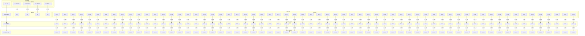

# 硬件射频链路逻辑图

```mermaid
flowchart TB
  %% =====================================================
  %% Meta-3D OTA 系统硬件射频链路逻辑图
  %% 展示 BSE → Channel Emulator → PA 阵列 → 探头阵列 的逐级连接关系（自上而下）
  %% 所有连线均为射频线缆
  %% =====================================================

  subgraph BSE["基站仿真器
(4×RF 输出端口)"]
    direction TB
    BSE_ANCHOR["BSE 主机"]
    subgraph BSE_PORTS["输出端口"]
      direction TB
      BSE_RF01["RF1: 输出端口"]
      BSE_RF02["RF2: 输出端口"]
      BSE_RF03["RF3: 输出端口"]
      BSE_RF04["RF4: 输出端口"]
    end
  end

  subgraph CE["信道仿真器
(4 输入 → 64 输出)"]
    direction TB
    CE_ANCHOR["信道仿真器主机"]
    subgraph CE_IN["输入端口"]
      direction TB
      CE_IN01["IN1"]
      CE_IN02["IN2"]
      CE_IN03["IN3"]
      CE_IN04["IN4"]
    end
    subgraph CE_OUT_BLOCK["输出端口"]
      direction TB
      CE_OUT01["OUT01"]
      CE_OUT02["OUT02"]
      CE_OUT03["OUT03"]
      CE_OUT04["OUT04"]
      CE_OUT05["OUT05"]
      CE_OUT06["OUT06"]
      CE_OUT07["OUT07"]
      CE_OUT08["OUT08"]
      CE_OUT09["OUT09"]
      CE_OUT10["OUT10"]
      CE_OUT11["OUT11"]
      CE_OUT12["OUT12"]
      CE_OUT13["OUT13"]
      CE_OUT14["OUT14"]
      CE_OUT15["OUT15"]
      CE_OUT16["OUT16"]
      CE_OUT17["OUT17"]
      CE_OUT18["OUT18"]
      CE_OUT19["OUT19"]
      CE_OUT20["OUT20"]
      CE_OUT21["OUT21"]
      CE_OUT22["OUT22"]
      CE_OUT23["OUT23"]
      CE_OUT24["OUT24"]
      CE_OUT25["OUT25"]
      CE_OUT26["OUT26"]
      CE_OUT27["OUT27"]
      CE_OUT28["OUT28"]
      CE_OUT29["OUT29"]
      CE_OUT30["OUT30"]
      CE_OUT31["OUT31"]
      CE_OUT32["OUT32"]
      CE_OUT33["OUT33"]
      CE_OUT34["OUT34"]
      CE_OUT35["OUT35"]
      CE_OUT36["OUT36"]
      CE_OUT37["OUT37"]
      CE_OUT38["OUT38"]
      CE_OUT39["OUT39"]
      CE_OUT40["OUT40"]
      CE_OUT41["OUT41"]
      CE_OUT42["OUT42"]
      CE_OUT43["OUT43"]
      CE_OUT44["OUT44"]
      CE_OUT45["OUT45"]
      CE_OUT46["OUT46"]
      CE_OUT47["OUT47"]
      CE_OUT48["OUT48"]
      CE_OUT49["OUT49"]
      CE_OUT50["OUT50"]
      CE_OUT51["OUT51"]
      CE_OUT52["OUT52"]
      CE_OUT53["OUT53"]
      CE_OUT54["OUT54"]
      CE_OUT55["OUT55"]
      CE_OUT56["OUT56"]
      CE_OUT57["OUT57"]
      CE_OUT58["OUT58"]
      CE_OUT59["OUT59"]
      CE_OUT60["OUT60"]
      CE_OUT61["OUT61"]
      CE_OUT62["OUT62"]
      CE_OUT63["OUT63"]
      CE_OUT64["OUT64"]
    end
  end

  subgraph PA_BLOCK["功率放大器阵列
(64 个单元)"]
    direction TB
    PA_ANCHOR["PA 机柜阵列"]
    PA01["PA01"]
    PA02["PA02"]
    PA03["PA03"]
    PA04["PA04"]
    PA05["PA05"]
    PA06["PA06"]
    PA07["PA07"]
    PA08["PA08"]
    PA09["PA09"]
    PA10["PA10"]
    PA11["PA11"]
    PA12["PA12"]
    PA13["PA13"]
    PA14["PA14"]
    PA15["PA15"]
    PA16["PA16"]
    PA17["PA17"]
    PA18["PA18"]
    PA19["PA19"]
    PA20["PA20"]
    PA21["PA21"]
    PA22["PA22"]
    PA23["PA23"]
    PA24["PA24"]
    PA25["PA25"]
    PA26["PA26"]
    PA27["PA27"]
    PA28["PA28"]
    PA29["PA29"]
    PA30["PA30"]
    PA31["PA31"]
    PA32["PA32"]
    PA33["PA33"]
    PA34["PA34"]
    PA35["PA35"]
    PA36["PA36"]
    PA37["PA37"]
    PA38["PA38"]
    PA39["PA39"]
    PA40["PA40"]
    PA41["PA41"]
    PA42["PA42"]
    PA43["PA43"]
    PA44["PA44"]
    PA45["PA45"]
    PA46["PA46"]
    PA47["PA47"]
    PA48["PA48"]
    PA49["PA49"]
    PA50["PA50"]
    PA51["PA51"]
    PA52["PA52"]
    PA53["PA53"]
    PA54["PA54"]
    PA55["PA55"]
    PA56["PA56"]
    PA57["PA57"]
    PA58["PA58"]
    PA59["PA59"]
    PA60["PA60"]
    PA61["PA61"]
    PA62["PA62"]
    PA63["PA63"]
    PA64["PA64"]
  end

  subgraph PROBE["MPAC 探头阵列
(64 个探头)"]
    direction TB
    PROBE_ANCHOR["探头阵列（环形）"]
    PRB01["Probe01"]
    PRB02["Probe02"]
    PRB03["Probe03"]
    PRB04["Probe04"]
    PRB05["Probe05"]
    PRB06["Probe06"]
    PRB07["Probe07"]
    PRB08["Probe08"]
    PRB09["Probe09"]
    PRB10["Probe10"]
    PRB11["Probe11"]
    PRB12["Probe12"]
    PRB13["Probe13"]
    PRB14["Probe14"]
    PRB15["Probe15"]
    PRB16["Probe16"]
    PRB17["Probe17"]
    PRB18["Probe18"]
    PRB19["Probe19"]
    PRB20["Probe20"]
    PRB21["Probe21"]
    PRB22["Probe22"]
    PRB23["Probe23"]
    PRB24["Probe24"]
    PRB25["Probe25"]
    PRB26["Probe26"]
    PRB27["Probe27"]
    PRB28["Probe28"]
    PRB29["Probe29"]
    PRB30["Probe30"]
    PRB31["Probe31"]
    PRB32["Probe32"]
    PRB33["Probe33"]
    PRB34["Probe34"]
    PRB35["Probe35"]
    PRB36["Probe36"]
    PRB37["Probe37"]
    PRB38["Probe38"]
    PRB39["Probe39"]
    PRB40["Probe40"]
    PRB41["Probe41"]
    PRB42["Probe42"]
    PRB43["Probe43"]
    PRB44["Probe44"]
    PRB45["Probe45"]
    PRB46["Probe46"]
    PRB47["Probe47"]
    PRB48["Probe48"]
    PRB49["Probe49"]
    PRB50["Probe50"]
    PRB51["Probe51"]
    PRB52["Probe52"]
    PRB53["Probe53"]
    PRB54["Probe54"]
    PRB55["Probe55"]
    PRB56["Probe56"]
    PRB57["Probe57"]
    PRB58["Probe58"]
    PRB59["Probe59"]
    PRB60["Probe60"]
    PRB61["Probe61"]
    PRB62["Probe62"]
    PRB63["Probe63"]
    PRB64["Probe64"]
  end

  BSE_ANCHOR --> CE_ANCHOR
  CE_ANCHOR --> PA_ANCHOR
  PA_ANCHOR --> PROBE_ANCHOR

  BSE_RF01 -->|RF 线缆| CE_IN01
  BSE_RF02 -->|RF 线缆| CE_IN02
  BSE_RF03 -->|RF 线缆| CE_IN03
  BSE_RF04 -->|RF 线缆| CE_IN04
  CE_OUT01 -->|RF 线缆| PA01
  CE_OUT02 -->|RF 线缆| PA02
  CE_OUT03 -->|RF 线缆| PA03
  CE_OUT04 -->|RF 线缆| PA04
  CE_OUT05 -->|RF 线缆| PA05
  CE_OUT06 -->|RF 线缆| PA06
  CE_OUT07 -->|RF 线缆| PA07
  CE_OUT08 -->|RF 线缆| PA08
  CE_OUT09 -->|RF 线缆| PA09
  CE_OUT10 -->|RF 线缆| PA10
  CE_OUT11 -->|RF 线缆| PA11
  CE_OUT12 -->|RF 线缆| PA12
  CE_OUT13 -->|RF 线缆| PA13
  CE_OUT14 -->|RF 线缆| PA14
  CE_OUT15 -->|RF 线缆| PA15
  CE_OUT16 -->|RF 线缆| PA16
  CE_OUT17 -->|RF 线缆| PA17
  CE_OUT18 -->|RF 线缆| PA18
  CE_OUT19 -->|RF 线缆| PA19
  CE_OUT20 -->|RF 线缆| PA20
  CE_OUT21 -->|RF 线缆| PA21
  CE_OUT22 -->|RF 线缆| PA22
  CE_OUT23 -->|RF 线缆| PA23
  CE_OUT24 -->|RF 线缆| PA24
  CE_OUT25 -->|RF 线缆| PA25
  CE_OUT26 -->|RF 线缆| PA26
  CE_OUT27 -->|RF 线缆| PA27
  CE_OUT28 -->|RF 线缆| PA28
  CE_OUT29 -->|RF 线缆| PA29
  CE_OUT30 -->|RF 线缆| PA30
  CE_OUT31 -->|RF 线缆| PA31
  CE_OUT32 -->|RF 线缆| PA32
  CE_OUT33 -->|RF 线缆| PA33
  CE_OUT34 -->|RF 线缆| PA34
  CE_OUT35 -->|RF 线缆| PA35
  CE_OUT36 -->|RF 线缆| PA36
  CE_OUT37 -->|RF 线缆| PA37
  CE_OUT38 -->|RF 线缆| PA38
  CE_OUT39 -->|RF 线缆| PA39
  CE_OUT40 -->|RF 线缆| PA40
  CE_OUT41 -->|RF 线缆| PA41
  CE_OUT42 -->|RF 线缆| PA42
  CE_OUT43 -->|RF 线缆| PA43
  CE_OUT44 -->|RF 线缆| PA44
  CE_OUT45 -->|RF 线缆| PA45
  CE_OUT46 -->|RF 线缆| PA46
  CE_OUT47 -->|RF 线缆| PA47
  CE_OUT48 -->|RF 线缆| PA48
  CE_OUT49 -->|RF 线缆| PA49
  CE_OUT50 -->|RF 线缆| PA50
  CE_OUT51 -->|RF 线缆| PA51
  CE_OUT52 -->|RF 线缆| PA52
  CE_OUT53 -->|RF 线缆| PA53
  CE_OUT54 -->|RF 线缆| PA54
  CE_OUT55 -->|RF 线缆| PA55
  CE_OUT56 -->|RF 线缆| PA56
  CE_OUT57 -->|RF 线缆| PA57
  CE_OUT58 -->|RF 线缆| PA58
  CE_OUT59 -->|RF 线缆| PA59
  CE_OUT60 -->|RF 线缆| PA60
  CE_OUT61 -->|RF 线缆| PA61
  CE_OUT62 -->|RF 线缆| PA62
  CE_OUT63 -->|RF 线缆| PA63
  CE_OUT64 -->|RF 线缆| PA64
  PA01 -->|RF 线缆| PRB01
  PA02 -->|RF 线缆| PRB02
  PA03 -->|RF 线缆| PRB03
  PA04 -->|RF 线缆| PRB04
  PA05 -->|RF 线缆| PRB05
  PA06 -->|RF 线缆| PRB06
  PA07 -->|RF 线缆| PRB07
  PA08 -->|RF 线缆| PRB08
  PA09 -->|RF 线缆| PRB09
  PA10 -->|RF 线缆| PRB10
  PA11 -->|RF 线缆| PRB11
  PA12 -->|RF 线缆| PRB12
  PA13 -->|RF 线缆| PRB13
  PA14 -->|RF 线缆| PRB14
  PA15 -->|RF 线缆| PRB15
  PA16 -->|RF 线缆| PRB16
  PA17 -->|RF 线缆| PRB17
  PA18 -->|RF 线缆| PRB18
  PA19 -->|RF 线缆| PRB19
  PA20 -->|RF 线缆| PRB20
  PA21 -->|RF 线缆| PRB21
  PA22 -->|RF 线缆| PRB22
  PA23 -->|RF 线缆| PRB23
  PA24 -->|RF 线缆| PRB24
  PA25 -->|RF 线缆| PRB25
  PA26 -->|RF 线缆| PRB26
  PA27 -->|RF 线缆| PRB27
  PA28 -->|RF 线缆| PRB28
  PA29 -->|RF 线缆| PRB29
  PA30 -->|RF 线缆| PRB30
  PA31 -->|RF 线缆| PRB31
  PA32 -->|RF 线缆| PRB32
  PA33 -->|RF 线缆| PRB33
  PA34 -->|RF 线缆| PRB34
  PA35 -->|RF 线缆| PRB35
  PA36 -->|RF 线缆| PRB36
  PA37 -->|RF 线缆| PRB37
  PA38 -->|RF 线缆| PRB38
  PA39 -->|RF 线缆| PRB39
  PA40 -->|RF 线缆| PRB40
  PA41 -->|RF 线缆| PRB41
  PA42 -->|RF 线缆| PRB42
  PA43 -->|RF 线缆| PRB43
  PA44 -->|RF 线缆| PRB44
  PA45 -->|RF 线缆| PRB45
  PA46 -->|RF 线缆| PRB46
  PA47 -->|RF 线缆| PRB47
  PA48 -->|RF 线缆| PRB48
  PA49 -->|RF 线缆| PRB49
  PA50 -->|RF 线缆| PRB50
  PA51 -->|RF 线缆| PRB51
  PA52 -->|RF 线缆| PRB52
  PA53 -->|RF 线缆| PRB53
  PA54 -->|RF 线缆| PRB54
  PA55 -->|RF 线缆| PRB55
  PA56 -->|RF 线缆| PRB56
  PA57 -->|RF 线缆| PRB57
  PA58 -->|RF 线缆| PRB58
  PA59 -->|RF 线缆| PRB59
  PA60 -->|RF 线缆| PRB60
  PA61 -->|RF 线缆| PRB61
  PA62 -->|RF 线缆| PRB62
  PA63 -->|RF 线缆| PRB63
  PA64 -->|RF 线缆| PRB64
```
