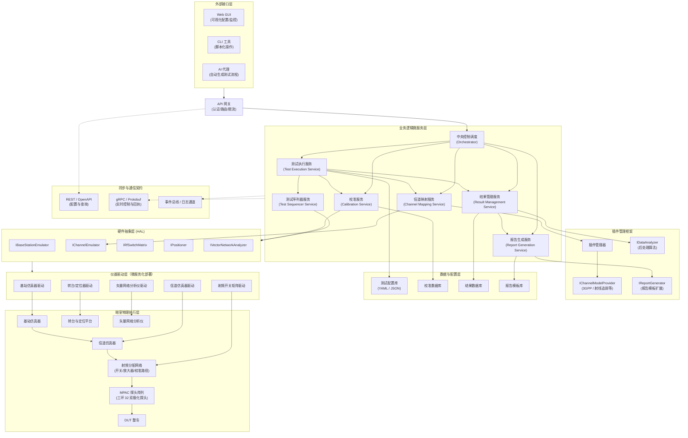

# Meta-3D 系统结构图

```mermaid
flowchart TB
  %% =======================
  %% Meta-3D OTA 测试系统结构概览
  %% 布局自上而下展示交互入口、业务微服务、硬件抽象与物理层
  %% =======================

  subgraph External["外部接口层"]
    GUI["Web GUI\n(可视化配置/监控)"]
    CLI["CLI 工具\n(脚本化操作)"]
    AI["AI 代理\n(自动生成测试流程)"]
  end

  External --> APIGW["API 网关\n(认证/路由/限流)"]

  subgraph Biz["业务逻辑微服务层"]
    TES["测试执行服务\n(Test Execution Service)"]
    TSS["测试序列器服务\n(Test Sequencer Service)"]
    CAL["校准服务\n(Calibration Service)"]
    CHM["信道映射服务\n(Channel Mapping Service)"]
    RMS["结果管理服务\n(Result Management Service)"]
    RPT["报告生成服务\n(Report Generation Service)"]
    CTRL["中央控制调度\n(Orchestrator)"]
  end

  APIGW --> CTRL
  CTRL --> TES
  CTRL --> RMS
  CTRL --> CAL
  CTRL --> CHM
  CTRL --> RPT

  TES --> TSS
  TES --> RMS
  TES --> CAL
  TES --> CHM
  RMS --> RPT

  subgraph Plugins["插件管理框架"]
    PM["插件管理器"]
    CMP["IChannelModelProvider\n(3GPP / 射线追踪等)"]
    ANA["IDataAnalyzer\n(后处理算法)"]
    REP["IReportGenerator\n(报告模板扩展)"]
  end

  CHM --> PM
  PM --> CMP
  RMS --> ANA
  RPT --> REP

  subgraph Data["数据与配置层"]
    CFG["测试配置库\n(YAML / JSON)"]
    CALDB["校准数据库"]
    RESDB["结果数据库"]
    TMPL["报告模板库"]
  end

  TES --> CFG
  CAL --> CALDB
  RMS --> RESDB
  RPT --> TMPL

  subgraph HAL["硬件抽象层 (HAL)"]
    BSE_IF["IBaseStationEmulator"]
    CH_IF["IChannelEmulator"]
    RF_IF["IRfSwitchMatrix"]
    POS_IF["IPositioner"]
    VNA_IF["IVectorNetworkAnalyzer"]
  end

  TSS --> HAL
  CAL --> HAL
  CHM --> CH_IF

  subgraph Drivers["仪器驱动层（微服务化部署）"]
    BSE_DRV["基站仿真器驱动"]
    CH_DRV["信道仿真器驱动"]
    RF_DRV["射频开关矩阵驱动"]
    POS_DRV["转台/定位器驱动"]
    VNA_DRV["矢量网络分析仪驱动"]
  end

  HAL --> Drivers

  subgraph Hardware["暗室物理执行层"]
    BSE_HW["基站仿真器"]
    CH_HW["信道仿真器"]
    RF_NET["射频分配网络\n(开关/放大器/校准路径)"]
    MPAC["MPAC 探头阵列\n(三环 32 双极化探头)"]
    DUT["DUT 整车"]
    POS_HW["转台与定位平台"]
    VNA_HW["矢量网络分析仪"]
  end

  BSE_DRV --> BSE_HW
  CH_DRV --> CH_HW
  RF_DRV --> RF_NET
  POS_DRV --> POS_HW
  VNA_DRV --> VNA_HW

  BSE_HW --> CH_HW
  CH_HW --> RF_NET
  RF_NET --> MPAC
  MPAC --> DUT

  subgraph Sync["同步与通信契约"]
    REST["REST / OpenAPI\n(配置与查询)"]
    GRPC["gRPC / Protobuf\n(实时控制与回执)"]
    Queue["事件总线 / 日志通道"]
  end

  APIGW -.-> REST
  Biz -.-> GRPC
  Biz -.-> Queue
```
