# 虚拟路测产品 - 架构设计详解

## 目录

- [1. 整体架构](#1-整体架构)
- [2. 统一测试抽象层](#2-统一测试抽象层)
- [3. 数字孪生引擎](#3-数字孪生引擎)
- [4. 传导测试架构](#4-传导测试架构)
- [5. OTA测试架构](#5-ota测试架构)
- [6. 数据模型](#6-数据模型)
- [7. API设计](#7-api设计)
- [8. 前端架构](#8-前端架构)

---

## 1. 整体架构

### 1.1 系统分层架构

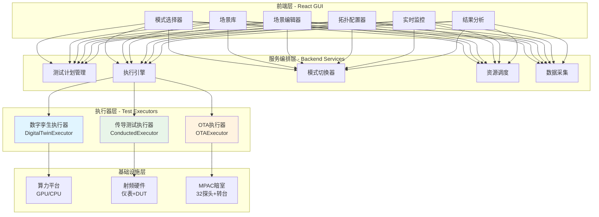

### 1.2 三种测试模式架构对比

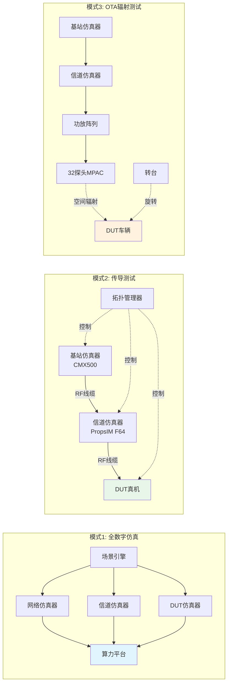

---

## 2. 统一测试抽象层

### 2.1 ITestExecutor 接口设计

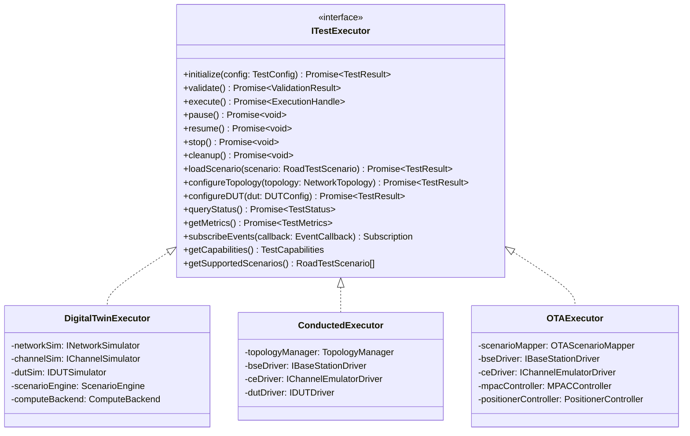

### 2.2 测试执行流程

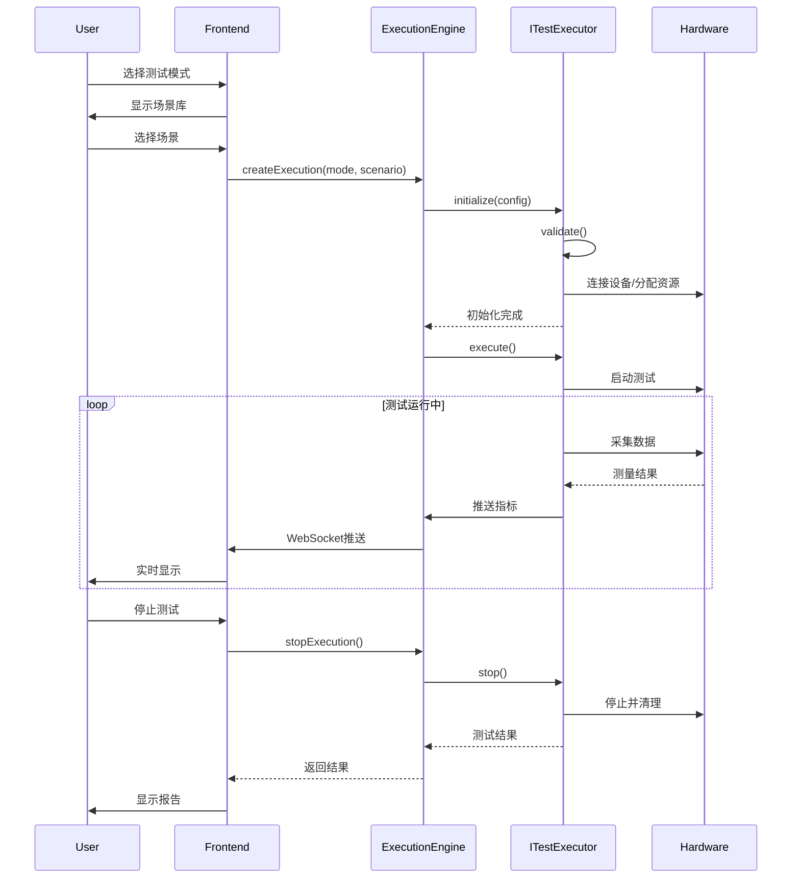

### 2.3 模式切换机制

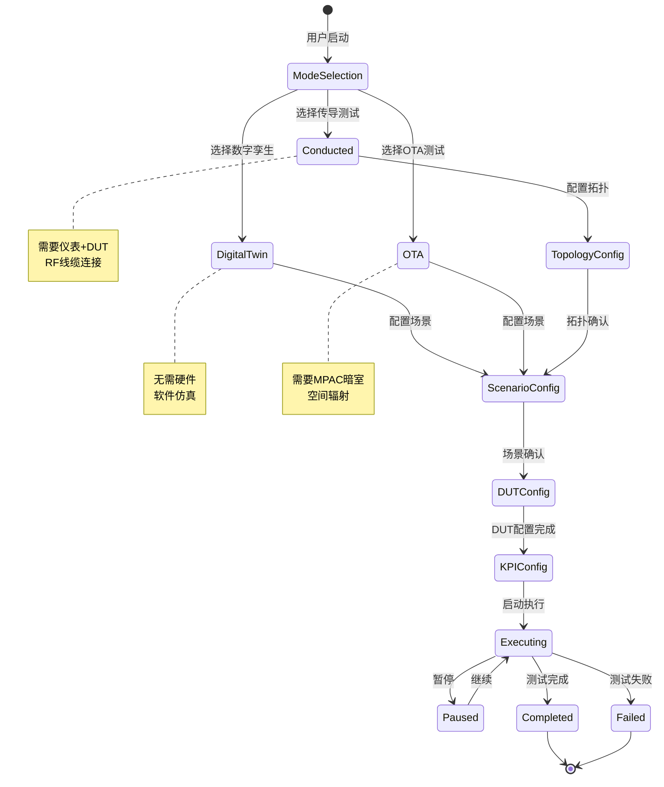

---

## 3. 数字孪生引擎

### 3.1 数字孪生架构

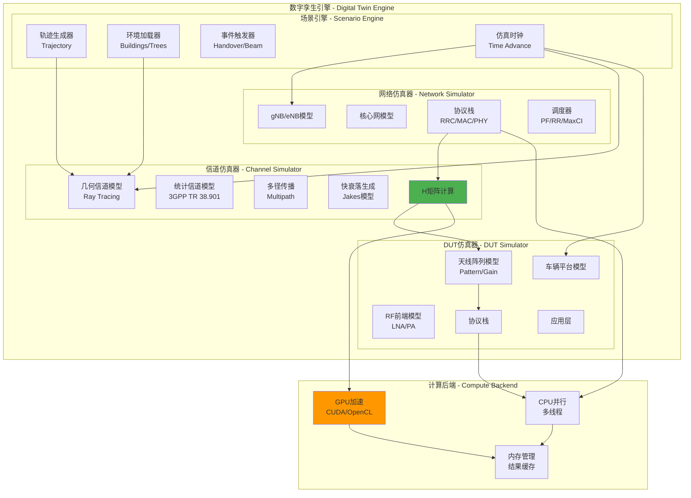

### 3.2 仿真时钟与事件驱动

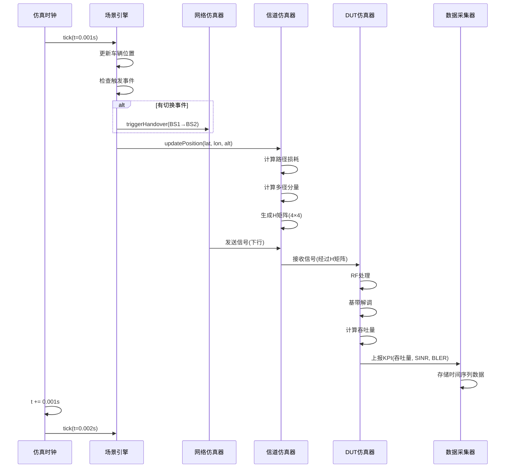

### 3.3 信道模型架构

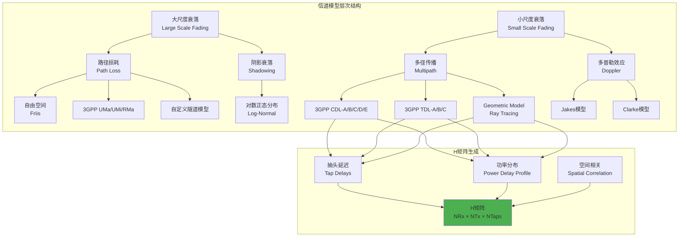

---

## 4. 传导测试架构

### 4.1 传导测试系统架构

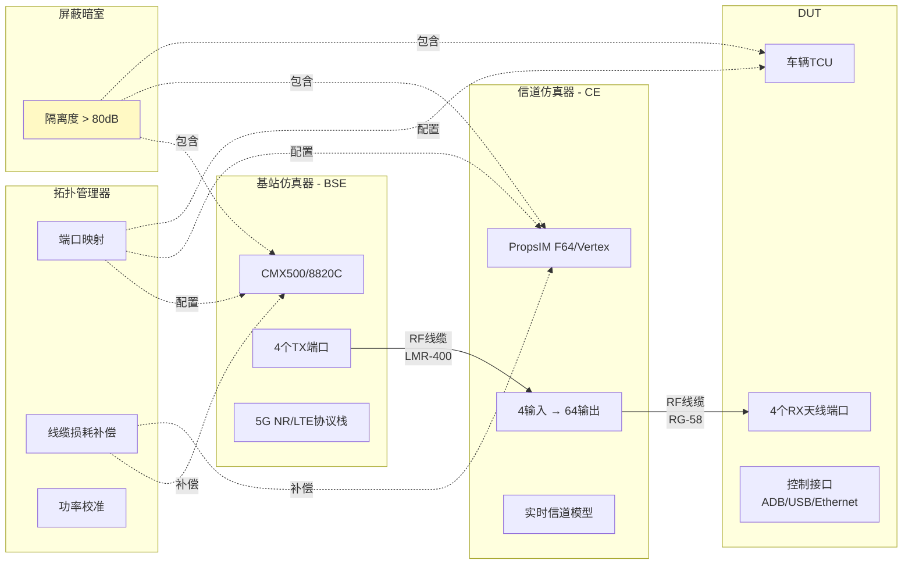

### 4.2 拓扑配置数据流

```mermaid
sequenceDiagram
    participant User
    participant TopologyUI as 拓扑配置器UI
    participant TopologyMgr as 拓扑管理器
    participant BSEDriver as 基站驱动
    participant CEDriver as 信道仿真器驱动
    participant DUTDriver as DUT驱动

    User->>TopologyUI: 选择MIMO 4×4拓扑
    TopologyUI->>User: 显示向导
    User->>TopologyUI: 选择CMX500
    User->>TopologyUI: 选择PropsIM F64
    User->>TopologyUI: 配置DUT (ADB接口)

    TopologyUI->>TopologyUI: 生成拓扑JSON
    TopologyUI->>TopologyMgr: validateTopology(topology)

    TopologyMgr->>TopologyMgr: 检查端口冲突
    TopologyMgr->>TopologyMgr: 检查连接有效性
    TopologyMgr-->>TopologyUI: 验证通过

    User->>TopologyUI: 应用配置
    TopologyUI->>TopologyMgr: applyTopology(topology)

    par 并行配置设备
        TopologyMgr->>BSEDriver: connect(192.168.1.100)
        TopologyMgr->>CEDriver: connect(192.168.1.101)
        TopologyMgr->>DUTDriver: connect(adb://192.168.1.102)
    end

    BSEDriver-->>TopologyMgr: 已连接
    CEDriver-->>TopologyMgr: 已连接
    DUTDriver-->>TopologyMgr: 已连接

    TopologyMgr->>BSEDriver: configureOutputs([1,2,3,4])
    TopologyMgr->>CEDriver: configureMapping(4输入→4输出)
    TopologyMgr->>DUTDriver: configureAntennas([1,2,3,4])

    TopologyMgr->>TopologyMgr: 执行功率校准
    TopologyMgr-->>TopologyUI: 配置完成
    TopologyUI->>User: 显示拓扑状态
```

### 4.3 RF链路损耗补偿

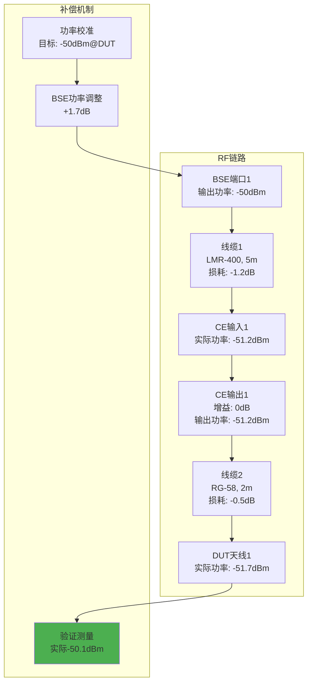

### 4.4 DUT控制架构

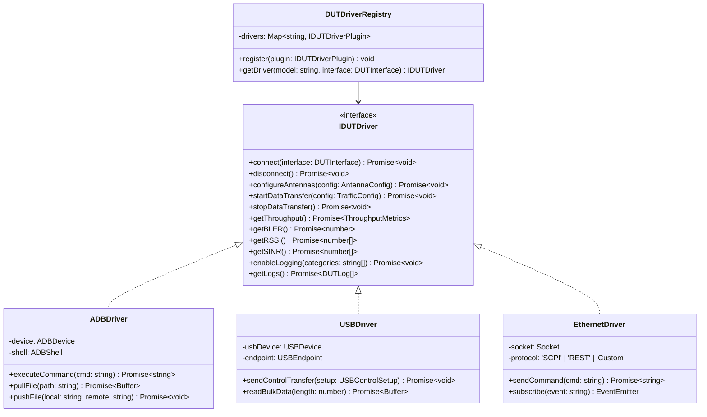

---

## 5. OTA测试架构

### 5.1 场景到OTA映射

```mermaid
graph TB
    subgraph "路测场景 - Road Test Scenario"
        SC1[轨迹<br/>Trajectory<br/>坐标序列+时间戳]
        SC2[环境<br/>Environment<br/>城市/高速/隧道]
        SC3[速度<br/>Speed<br/>30-120 km/h]
        SC4[基站位置<br/>BS Locations<br/>经纬度+高度]
    end

    subgraph "OTA场景映射器 - OTAScenarioMapper"
        MAP1[轨迹→转台运动]
        MAP2[环境→信道模型]
        MAP3[速度→多普勒]
        MAP4[基站→波束方向]
    end

    subgraph "OTA配置 - OTA Configuration"
        OTA1[转台序列<br/>方位角: [0°, 45°, 90°...]<br/>俯仰角: [0°, 10°, 20°...]]
        OTA2[信道模型<br/>3GPP UMa/UMi/RMa]
        OTA3[多普勒配置<br/>最大多普勒频移]
        OTA4[探头权重<br/>32探头复数权重]
    end

    SC1 --> MAP1
    SC2 --> MAP2
    SC3 --> MAP3
    SC4 --> MAP4

    MAP1 --> OTA1
    MAP2 --> OTA2
    MAP3 --> OTA3
    MAP4 --> OTA4

    style MAP1 fill:#e1f5ff
    style MAP2 fill:#e8f5e9
    style MAP3 fill:#fff3e0
    style MAP4 fill:#f3e5f5
```

### 5.2 MPAC探头权重计算

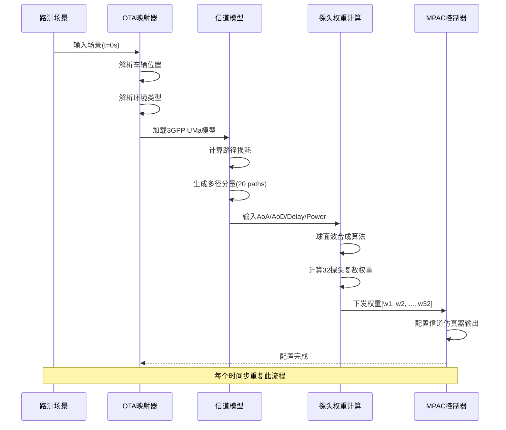

### 5.3 OTA测试时间序列

```mermaid
gantt
    title OTA路测场景执行时间线
    dateFormat  s
    axisFormat  %Ss

    section 场景初始化
    加载场景配置           :done, init1, 0, 2s
    连接MPAC设备          :done, init2, 2s, 4s
    校准探头              :done, init3, 4s, 10s

    section 测试执行
    时刻t=0s, 位置A, BS1  :active, exec1, 10s, 15s
    时刻t=5s, 位置B, BS1  :exec2, 15s, 20s
    时刻t=10s, 位置C, BS1→BS2切换 :crit, exec3, 20s, 25s
    时刻t=15s, 位置D, BS2 :exec4, 25s, 30s
    时刻t=20s, 位置E, BS2 :exec5, 30s, 35s

    section 数据采集
    采集吞吐量            :data1, 10s, 35s
    采集RSRP/SINR        :data2, 10s, 35s
    采集切换事件          :crit, data3, 20s, 25s

    section 结果处理
    保存原始数据          :result1, 35s, 37s
    计算KPI              :result2, 37s, 39s
    生成报告              :result3, 39s, 42s
```

---

## 6. 数据模型

### 6.1 核心数据模型关系图

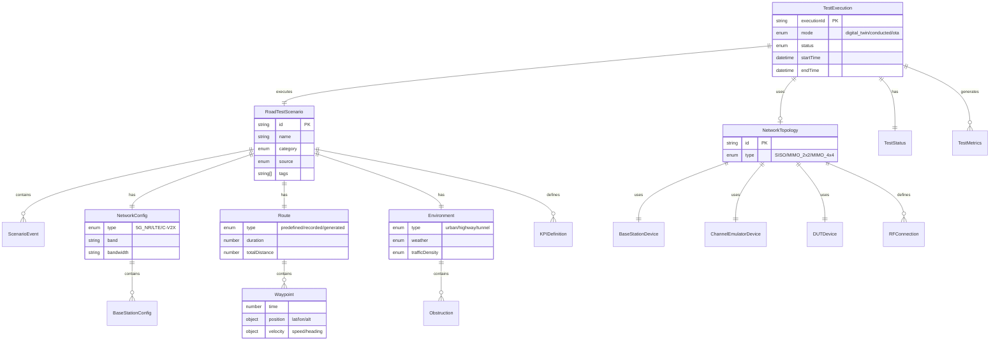

### 6.2 场景事件类型

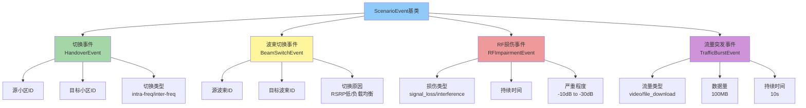

---

## 7. API设计

### 7.1 RESTful API端点树

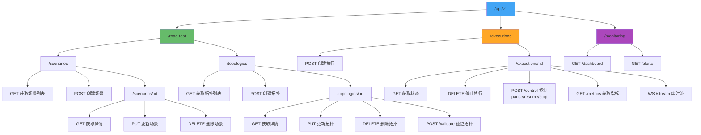

### 7.2 WebSocket实时数据流协议

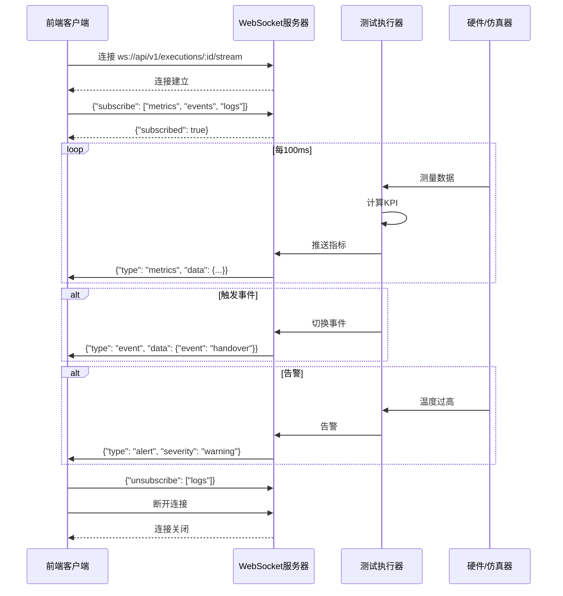

---

## 8. 前端架构

### 8.1 前端组件树

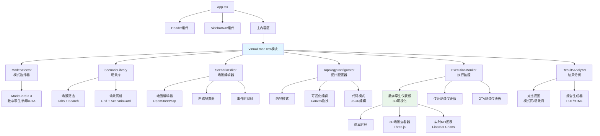

### 8.2 状态管理架构

```mermaid
graph TB
    subgraph "前端状态管理"
        subgraph "服务端状态 - TanStack Query"
            Q1[useScenarios<br/>场景列表]
            Q2[useScenarioDetail<br/>场景详情]
            Q3[useTopologies<br/>拓扑列表]
            Q4[useExecution<br/>执行状态]
            Q5[useMetrics<br/>实时指标]
        end

        subgraph "UI状态 - React Hooks"
            S1[selectedMode<br/>useState]
            S2[selectedScenario<br/>useState]
            S3[topologyConfig<br/>useState]
            S4[filterCategory<br/>useState]
            S5[chartTimeRange<br/>useState]
        end

        subgraph "全局状态 - Context"
            C1[UserContext<br/>用户信息]
            C2[ThemeContext<br/>主题配置]
            C3[NotificationContext<br/>通知队列]
        end
    end

    subgraph "API服务层"
        API1[fetchScenarios]
        API2[createExecution]
        API3[getMetrics]
    end

    subgraph "WebSocket层"
        WS1[useWebSocket<br/>实时数据订阅]
    end

    Q1 & Q2 & Q3 --> API1
    Q4 --> API2
    Q5 --> API3 & WS1

    style Q1 fill:#4caf50
    style Q5 fill:#ff9800
    style WS1 fill:#f44336
```

### 8.3 场景编辑器架构

```mermaid
graph TB
    ScenarioEditor[ScenarioEditor组件]

    ScenarioEditor --> Tabs[编辑器Tabs]

    Tabs --> Tab1[基本信息]
    Tabs --> Tab2[网络配置]
    Tabs --> Tab3[路径轨迹]
    Tabs --> Tab4[环境设置]
    Tabs --> Tab5[事件设置]
    Tabs --> Tab6[KPI定义]

    Tab1 --> Form1[名称/分类/标签<br/>Mantine Form]

    Tab2 --> NetForm[网络类型选择<br/>5G NR/LTE/C-V2X]
    Tab2 --> BSEditor[基站编辑器<br/>地图上放置基站]

    Tab3 --> MapView[地图视图<br/>OpenStreetMap/Leaflet]
    Tab3 --> DrawTool[绘制工具<br/>绘制轨迹路径]
    Tab3 --> SpeedProfile[速度曲线<br/>时间-速度图表]

    Tab4 --> EnvType[环境类型<br/>城市/高速/隧道]
    Tab4 --> Weather[天气条件]
    Tab4 --> ObstEditor[障碍物编辑器<br/>建筑/树木]

    Tab5 --> Timeline[时间轴组件]
    Tab5 --> EventLib[事件库<br/>拖拽添加事件]

    Tab6 --> KPIList[KPI列表<br/>吞吐量/延迟/BLER]
    Tab6 --> TargetInput[目标值输入<br/>数值+单位+百分位]

    style MapView fill:#4caf50
    style Timeline fill:#ff9800
```

---

## 9. 技术选型总结

### 9.1 前端技术栈

| 层次 | 技术选型 | 版本 | 说明 |
|------|---------|------|------|
| **框架** | React | 18.3.1 | 已有 |
| **语言** | TypeScript | 5.9.3 | 已有 |
| **构建** | Vite | 7.1.7 | 已有 |
| **UI库** | Mantine | 8.3.6 | 已有 |
| **状态管理** | TanStack Query | 5.90.5 | 已有 |
| **HTTP客户端** | Axios | 1.12.2 | 已有 |
| **图表** | Recharts / Chart.js | TBD | 新增 |
| **3D可视化** | Three.js | TBD | 新增 |
| **地图** | Leaflet + OpenStreetMap | TBD | 新增 |
| **WebSocket** | native WebSocket API | - | 新增 |

### 9.2 后端技术栈（建议）

| 层次 | 技术选型 | 说明 |
|------|---------|------|
| **框架** | FastAPI (Python) / NestJS (TypeScript) | 推荐FastAPI，与仿真引擎集成方便 |
| **数据库** | PostgreSQL + TimescaleDB | 时序数据优化 |
| **对象存储** | MinIO / S3 | 场景数据存储 |
| **消息队列** | Redis / RabbitMQ | 任务队列 |
| **WebSocket** | Socket.IO / FastAPI WebSocket | 实时数据推送 |
| **任务调度** | Celery / Bull | 异步任务 |

### 9.3 数字孪生仿真引擎（待选型）

| 选项 | 优势 | 劣势 | 推荐度 |
|------|------|------|-------|
| **ns-3** | 开源，5G NR模块成熟，社区活跃 | C++，学习曲线陡峭 | ⭐⭐⭐⭐⭐ |
| **MATLAB** | 工具箱丰富，快速原型开发 | 闭源，License费用高 | ⭐⭐⭐ |
| **自研引擎** | 完全可控，定制化强 | 开发周期长，风险高 | ⭐⭐ |
| **商业仿真软件** | 精度高，支持好 | 成本极高 | ⭐⭐ |

**推荐**: ns-3 + Python绑定 (ns3-ai)，结合GPU加速库（CuPy/PyTorch）

---

## 10. 部署架构

### 10.1 系统部署拓扑

```mermaid
graph TB
    subgraph "用户层"
        Browser[Web浏览器]
    end

    subgraph "应用层 - Docker Compose"
        Nginx[Nginx<br/>反向代理]
        Frontend[前端容器<br/>React SPA]
        Backend[后端容器<br/>FastAPI]
        WSServer[WebSocket服务器]
    end

    subgraph "服务层"
        DTEngine[数字孪生引擎<br/>ns-3容器]
        ConductedCtrl[传导测试控制器]
        OTACtrl[OTA测试控制器]
    end

    subgraph "数据层"
        Postgres[(PostgreSQL<br/>元数据)]
        TimescaleDB[(TimescaleDB<br/>时序数据)]
        MinIO[(MinIO<br/>对象存储<br/>场景文件)]
        Redis[(Redis<br/>缓存+队列)]
    end

    subgraph "硬件层"
        GPU[GPU服务器<br/>NVIDIA A100]
        Instruments[仪表设备<br/>CMX500/PropsIM]
        MPAC[MPAC暗室<br/>32探头]
    end

    Browser --> Nginx
    Nginx --> Frontend
    Nginx --> Backend
    Nginx --> WSServer

    Backend --> DTEngine
    Backend --> ConductedCtrl
    Backend --> OTACtrl

    Backend --> Postgres & TimescaleDB & MinIO & Redis

    DTEngine --> GPU
    ConductedCtrl --> Instruments
    OTACtrl --> MPAC

    style Browser fill:#42a5f5
    style GPU fill:#ff9800
    style Instruments fill:#66bb6a
    style MPAC fill:#ab47bc
```

---

**文档结束**

相关文档:
- [VirtualRoadTest.md](./VirtualRoadTest.md) - 主设计文档
- [VirtualRoadTest-Implementation.md](./VirtualRoadTest-Implementation.md) - 开发者实施指南
