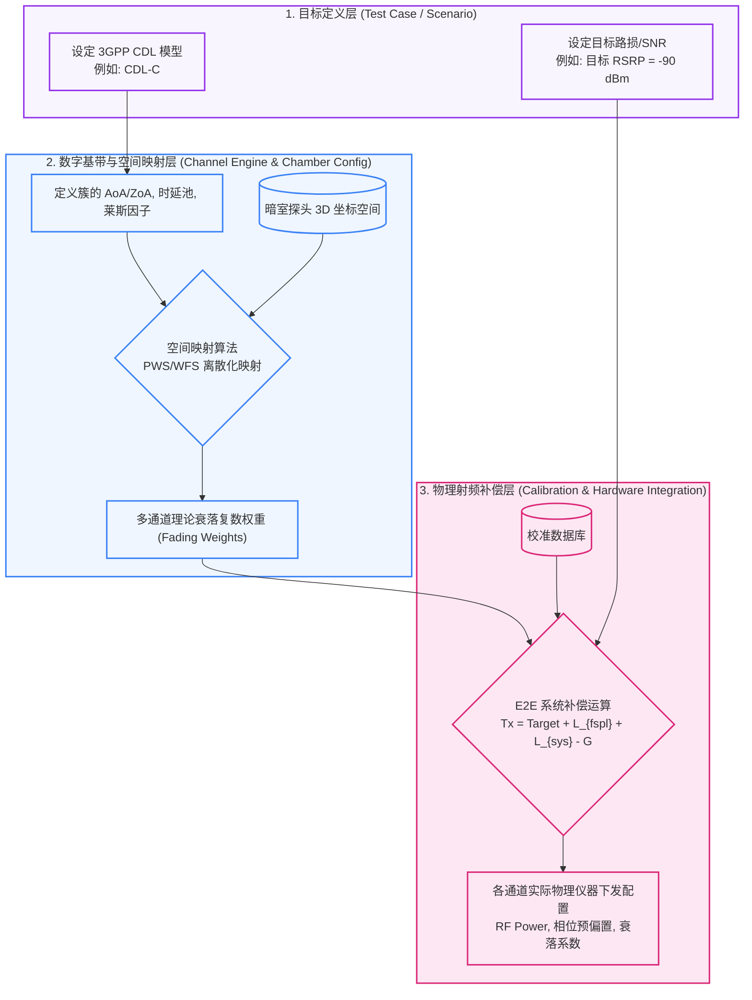

# MIMO OTA 核心链路集成与映射架构设计

本文档梳理和定义了 MIMO-First 平台中 **暗室配置 (Chamber Config)**、**校准 (Calibration)**、**信道引擎 (Channel Engine, CE)** 与 **测试管理 (Test Cases, 含功率/SNR)** 之间的嵌套关系与数据流传递逻辑。

## 1. 核心挑战与架构目标

我们的核心诉求是将纯数学的 3GPP CDL （或自定义路网）测试用例要求，精准且无损地转化为暗室内真实的电磁波物理场。这涉及空间几何（暗室）、衰落特征（信道）、物理损耗（校准）以及场景目标（功率/SNR）四大维度的深度融合。

## 2. 四大模块的嵌套层级流转图

整个链路可以被划分为三个由上至下的嵌套层级：**目标定义层** \-\> **数字基带与空间映射层** \-\> **物理射频补偿层**。

---

## 3. 架构阶段细节解析

### 3.1 阶段一：空间与时延映射 (Channel Engine + Chamber Config)

**逻辑目标：实现抽象几何信道向离散物理探头的空间投射。**

1. **CDL 解析**：3GPP CDL 规定的是到达角（AoA, ZoA）、离开角及其多径传播分布（连续概率），本质是一个“虚拟理想环境”。如果采用数字孪生（Digital Twin），则引入来自射线跟踪（Ray Tracing）的定制化光路。
2. **结合 Chamber Config**：Channel Engine 需要先通过接口读取到当前使用的系统组网配置中，下属所有 `Probe` 的绝对坐标 $(x, y, z)$ 或球坐标 $(R, \theta, \phi)$。
3. **映射算法**：CE 内部的 Mapping 模块（采用波场合成 Wavefield Synthesis, WFS 或平面波生成 PWG 算法）会将连续的能量“投影/分配”到暗室限定数量的探头上。所有的权重生成完全在数字基带层完成计算，产出**纯数字域的基带衰落复数矩阵 $\mathbf{H}_{CE}(t)$**。

### 3.2 阶段二：基准功率标定与链路计算 (Test Case + Chamber Physics)

**逻辑目标：根据测试断言（用例目标）倒推出理想发射源强度。**

系统会通过**倒推（Back-calculation）**计算信道仿真器输出端的理论物理功率初步设定：
当用例要求在静区中心拥有特定的参考信号接收功率时，必须跨越空间进行预加重：

$$
P_{CE\_port} = P_{Target\_QZ} + L_{FSPL}
$$

其中，自由空间路径损耗计算依赖真实的暗室探头半径 $R$。这是暗室配置信息第一次切实参与仪表的发射控制（非波束）。

### 3.3 阶段三：校准数据融合补偿 (Calibration Fusion)

**逻辑目标：修复电磁物理界的硬件瑕疵，保证空间波束精确还原。**

1. **幅度衰减融合 (Amplitude Compensation)**:
   针对第 $i$ 个物理通道，校准数据库中存有一个由 `E2E Calibration` 测得的插入损耗 $L_{sys\_i}$（包含线损、开关矩阵网格损耗等）以及系统前置放大的增益 $G_{sys\_i}$。最终下发给 CE 端口的基准发射功率被严密修正为：
   $$ P_{Tx\_i} = P_{CE\_port} + L_{sys\_i} - G_{sys\_i} $$

2. **多通道相位协同 (Phase Compensation)**:
   暗室核心指标取决于多根微波硬线/软线的等长协同。只要存在物理温漂偏差，波场便会被完全扭曲。系统将步骤 3.1 中的纯数字波场合成附加相位偏置：
   $$ \Phi_{Final\_i}(t) = \Phi_{CDL\_Map\_i}(t) + \Phi_{Calibration\_Offset\_i} $$
   上述推演统一封装在 `MeasurementCompensation` 补偿模块域内执行。

---

## 4. 总结与调度控制流

当 `WorkflowEngine` 下达某一条虚拟路测任务时，系统调度的控制流如下：
1. `WorkflowEngine` 解析 `scenario` 并抽取 3GPP 环境标准 / 射线网格。
2. 调度并加载实时的 `ChamberConfiguration` 获取全阵列几何形态。
3. `ChannelEngine` 被作为纯数学外挂唤醒，结合上述两者生成理论时变衰落阵列。
4. `MeasurementCompensation` 调用校准库，对全维度生成的理想矩阵实装**损耗扣减 (Pathloss)** 与**频点级相位补偿 (Phase Rotate)**。
5. 通过底层的 `Hardware Abstraction Layer (HAL)`，驱动基站模拟器、前端大功率功放和信道仿真器执行真实用例下发。

*文档归档属性：系统级耦合设计指南*
