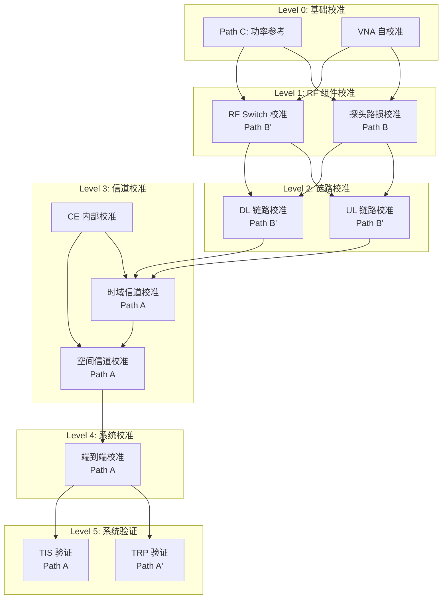

# Calibration Topology Design (校准链路拓扑设计)

## 文档信息

- **文档版本**: 1.0.0
- **创建日期**: 2026-01-26
- **所属子系统**: Calibration Subsystem
- **优先级**: P0 (CRITICAL)
- **状态**: Draft

## 1. 概述

### 1.1 目标

定义 MPAC OTA 测试系统中所有校准链路的完整拓扑结构，明确：
- 每种校准类型的信号路径
- 是否经过信道仿真器 (Channel Emulator)
- 旁路配置和参考链路
- 校准数据的依赖关系

### 1.2 校准链路分类

```
┌─────────────────────────────────────────────────────────────────┐
│                    校准链路分类                                  │
├─────────────────────────────────────────────────────────────────┤
│                                                                  │
│  Path A: 经 CE 路径 (Through CE)                                  │
│  ├── 用于: 端到端校准、信道验证                                    │
│  └── 特点: 包含完整的信号处理链路                                   │
│                                                                  │
│  Path B: 旁路 CE 路径 (Bypass CE)                                 │
│  ├── 用于: 探头路损校准、RF 链路纯净测量                            │
│  └── 特点: 隔离测量空间路径或单段 RF 链路                           │
│                                                                  │
│  Path C: 参考路径 (Reference)                                     │
│  ├── 用于: 功率基准建立、仪器校准                                   │
│  └── 特点: 提供可溯源的测量参考                                     │
│                                                                  │
└─────────────────────────────────────────────────────────────────┘
```

## 2. 完整链路拓扑图

### 2.1 系统级拓扑

```
                                    ┌─────────────────────────────────────────┐
                                    │           暗室 (Anechoic Chamber)         │
                                    │                                          │
┌──────────────┐                    │    ┌─────────┐         ┌─────────┐      │
│  BS Emulator │──┐                 │    │ Probe 1 │─────────│         │      │
│  (基站仿真器)  │  │                 │    └─────────┘         │         │      │
└──────────────┘  │                 │    ┌─────────┐         │  Quiet  │      │
                  ▼                 │    │ Probe 2 │─────────│  Zone   │      │
           ┌──────────────┐         │    └─────────┘         │ (静区)   │      │
           │   Channel    │         │         ⋮              │         │      │
           │   Emulator   │─────────┼────┌─────────┐         │   DUT   │      │
           │  (信道仿真器) │         │    │ Probe N │─────────│         │      │
           └──────────────┘         │    └─────────┘         └─────────┘      │
                  │                 │                                          │
                  ▼                 └─────────────────────────────────────────┘
           ┌──────────────┐                      │
           │  RF Switch   │                      │
           │   Matrix     │                      ▼
           │ (射频开关矩阵) │              ┌──────────────┐
           └──────────────┘              │    Signal    │
                  │                      │   Analyzer   │
                  ▼                      │  (信号分析仪)  │
           ┌──────────────┐              └──────────────┘
           │   PA Array   │
           │  (功放阵列)   │
           └──────────────┘
```

### 2.2 详细链路定义

#### Path A: 经 CE 路径 (下行链路 DL)

```
BS Emulator ──→ Channel Emulator ──→ RF Switch ──→ PA ──→ Probe ──→ QZ ──→ DUT
    │                  │                │           │        │         │
    │                  │                │           │        │         │
    ▼                  ▼                ▼           ▼        ▼         ▼
 [信号源]          [信道仿真]       [路径选择]    [功率放大]  [空间辐射]  [接收]
```

**用途**: 
- 信道模型验证 (PDP, 空间相关性)
- TIS 验证测试
- 端到端系统校准

---

#### Path A': 经 CE 路径 (上行链路 UL)

```
DUT ──→ QZ ──→ Probe ──→ LNA ──→ RF Switch ──→ Channel Emulator ──→ BS Emulator
  │       │        │        │          │                │                │
  ▼       ▼        ▼        ▼          ▼                ▼                ▼
[发射]  [空间传播]  [接收]   [低噪放]   [路径选择]      [信道仿真]       [分析]
```

**用途**:
- TRP 验证测试
- 上行链路增益校准

---

#### Path B: 旁路 CE 路径 (探头路损校准)

```
                    ┌──────────────────────────────────────┐
                    │           暗室 (Chamber)              │
                    │                                       │
VNA Port 1 ─────────┼───→ SGH (标准增益喇叭) ─────→ QZ ←───── Probe N
    ▲               │                                       │      │
    │               └───────────────────────────────────────│──────┘
    │                                                       │
    └───────────────────────────────────────────────────────┘
                           VNA Port 2

旁路说明:
- 不经过 Channel Emulator
- 不经过 RF Switch Matrix  
- 不经过 PA/LNA
- 仅测量 SGH 到 Probe 的空间路径
```

**用途**:
- 探头空间路损测量 (S21)
- 建立各探头的路损基准

---

#### Path B': 旁路 CE 路径 (RF 链路校准)

```
┌──────────────────────────────────────────────────────────────────┐
│                                                                   │
│  DL 链路校准:  VNA Port 1 ──→ PA ──→ RF Switch ──→ Probe ←── VNA Port 2
│                                                                   │
│  UL 链路校准:  VNA Port 1 ──→ Probe ──→ RF Switch ──→ LNA ←── VNA Port 2
│                                                                   │
└──────────────────────────────────────────────────────────────────┘

旁路说明:
- 不经过 Channel Emulator (纯 RF 链路测量)
- 经过 RF Switch Matrix (测量开关损耗)
- 经过 PA/LNA (测量增益)
```

**用途**:
- UL/DL 链路增益测量
- RF Switch 路径损耗测量
- PA/LNA 增益校准

---

#### Path C: 参考路径 (功率基准)

```
┌─────────────────────────────────────────────────────────────────┐
│                                                                  │
│  参考链路 1 (直连功率计):                                          │
│  Signal Generator ──→ 精密衰减器 ──→ Power Meter                 │
│                                                                  │
│  参考链路 2 (频谱参考):                                            │
│  Signal Generator ──→ 精密衰减器 ──→ Spectrum Analyzer           │
│                                                                  │
│  参考链路 3 (VNA 校准):                                            │
│  VNA ──→ 标准校准件 (Open/Short/Load/Thru)                        │
│                                                                  │
└─────────────────────────────────────────────────────────────────┘
```

**用途**:
- 建立可溯源的功率参考
- 仪器自校准
- 不确定度评估

---

## 3. 校准类型与链路映射

| 校准类型 | 使用路径 | 经过 CE | 经过 Switch | 经过 PA/LNA | 备注 |
|---------|---------|--------|-------------|-------------|------|
| **探头路损校准** | Path B | ❌ | ❌ | ❌ | 纯空间路径 |
| **RF Switch 校准** | Path B' | ❌ | ✅ | ❌ | 开关插损/隔离 |
| **UL 链路校准** | Path B' | ❌ | ✅ | ✅ LNA | 上行增益 |
| **DL 链路校准** | Path B' | ❌ | ✅ | ✅ PA | 下行增益 |
| **CE 内部校准** | - | ✅ 内部 | ❌ | ❌ | 厂商程序 |
| **时域信道校准** | Path A | ✅ | ✅ | ✅ | PDP 验证 |
| **空间信道校准** | Path A | ✅ | ✅ | ✅ | 相关性验证 |
| **端到端校准** | Path A | ✅ | ✅ | ✅ | 综合补偿 |
| **TRP 验证** | Path A' | ✅ | ✅ | ✅ | 系统验证 |
| **TIS 验证** | Path A | ✅ | ✅ | ✅ | 系统验证 |
| **功率参考** | Path C | ❌ | ❌ | ❌ | 基准建立 |

---

## 4. 校准依赖关系



**依赖规则**:
1. Level N 的校准必须在 Level N-1 完成后进行
2. 同一 Level 内的校准可以并行执行
3. 任一依赖校准失效时，需要从该层级开始重新校准

---

## 5. 校准有效期定义

| 校准类型 | 建议有效期 | 失效触发条件 |
|---------|-----------|-------------|
| 功率参考 | 12 个月 | 仪器年检 |
| VNA 自校准 | 每日 | 温度变化 >5°C |
| 探头路损 | 6 个月 | 暗室改动 |
| RF Switch | 6 个月 | 设备更换 |
| UL/DL 链路 | 3 个月 | 温度漂移 |
| CE 内部 | 3 个月 | 固件更新 |
| 信道校准 | 1 个月 | 探头位置调整 |
| 端到端 | 1 个月 | 任一上游失效 |
| TRP/TIS 验证 | 每次测试前 | 校准数据更新 |

---

## 6. 实现建议

### 6.1 代码结构

```
api-service/app/services/calibration/
├── __init__.py
├── calibration_orchestrator.py      # 校准编排器
├── path_loss_calibration.py         # Path B: 探头路损
├── rf_switch_calibration.py         # Path B': 开关矩阵 (新增)
├── rf_chain_calibration.py          # Path B': UL/DL 链路
├── channel_calibration.py           # Path A: 信道校准
├── e2e_calibration.py               # Path A: 端到端 (新增)
├── reference_calibration.py         # Path C: 参考校准 (新增)
└── dependency_manager.py            # 依赖管理器 (新增)
```

### 6.2 API 端点

```
POST /api/v1/calibration/topology/validate     # 验证当前链路配置
GET  /api/v1/calibration/topology/status       # 获取各链路校准状态
POST /api/v1/calibration/dependency/check      # 检查依赖是否满足
GET  /api/v1/calibration/dependency/graph      # 获取依赖图
```

### 6.3 数据库表

```sql
-- 校准链路配置表
CREATE TABLE calibration_paths (
    id SERIAL PRIMARY KEY,
    path_type VARCHAR(10) NOT NULL,  -- 'A', 'A_prime', 'B', 'B_prime', 'C'
    path_name VARCHAR(100) NOT NULL,
    description TEXT,
    components JSONB,  -- 链路中包含的设备组件
    created_at TIMESTAMP DEFAULT NOW()
);

-- 校准依赖关系表
CREATE TABLE calibration_dependencies (
    id SERIAL PRIMARY KEY,
    calibration_type VARCHAR(50) NOT NULL,
    depends_on VARCHAR(50) NOT NULL,
    is_mandatory BOOLEAN DEFAULT TRUE
);
```
